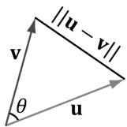
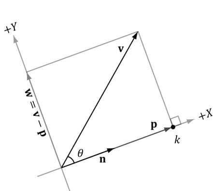
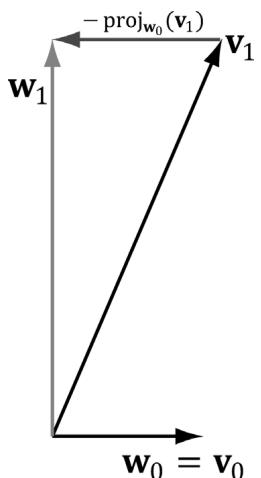
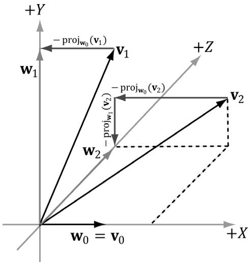

## 单位向量

有 `u = (x, y, z)`，计算长度有
$$
\left| \left| \mathbf {u} \right| \right| = \sqrt {y ^ {2} + a ^ {2}} = \sqrt {y ^ {2} + \left(\sqrt {x ^ {2} + z ^ {2}}\right) ^ {2}} = \sqrt {x ^ {2} + y ^ {2} + z ^ {2}} \quad (\text {e q . 1 . 1})
$$
向量是具有大小和方向的量，通常在使用时，大小可以通过乘系数来变换，换句话说，向量的方向属性更具实际意义，因此为了方便使用和计算，通常需要对向量进行归一化操作(将长度设为1)
即：
$$
\hat {\mathbf {u}} = \frac {\mathbf {u}}{\| \mathbf {u} \|} = \left(\frac {x}{\| \mathbf {u} \|}, \frac {y}{\| \mathbf {u} \|}, \frac {z}{\| \mathbf {u} \|}\right) \tag {eq.1.2}
$$
证明有：
$$
\left\| \hat {\mathbf {u}} \right\| = \sqrt {\left(\frac {x}{\left\| \mathbf {u} \right\|}\right) ^ {2} + \left(\frac {y}{\left\| \mathbf {u} \right\|}\right) ^ {2} + \left(\frac {z}{\left\| \mathbf {u} \right\|}\right) ^ {2}} = \frac {\sqrt {x ^ {2} + y ^ {2} + z ^ {2}}}{\sqrt {\left\| \mathbf {u} \right\| ^ {2}}} = \frac {\left\| \mathbf {u} \right\|}{\left\| \mathbf {u} \right\|} = 1
$$
## 点积

根据向量定义，点乘即各个分量相乘后相加
$$
\mathbf {u} \cdot \mathbf {v} = u _ {x} v _ {x} + u _ {y} v _ {y} + u _ {z} v _ {z} \tag {eq.1.3}
$$
从物理或几何角度看：

- 当 θ=0∘θ=0∘（两向量同向）时，点积应等于长度乘积，cos⁡0∘=1cos0∘=1 正好给出这个。
    
- 当 θ=90∘θ=90∘（垂直）时，点积应为 0，cos⁡90∘=0cos90∘=0 正好匹配。
    
- 当 θ=180∘θ=180∘（反向）时，点积应为负的模长积，cos⁡180∘=−1cos180∘=−1 匹配。
因此
$$
\mathbf {u} \cdot \mathbf {v} = \left\| \mathbf {u} \right\| \left\| \mathbf {v} \right\| \cos \theta \tag {eq.1.4}
$$

数学证明如下：
由余弦定理：
$$
\|\mathbf{u} - \mathbf{v}\|^2 = \|\mathbf{u}\|^2 + \|\mathbf{v}\|^2 - 2\|\mathbf{u}\|\|\mathbf{v}\|\cos\theta
$$

左边用点积展开（基于定义）：
$$
\|\mathbf{u} - \mathbf{v}\|^2 = (\mathbf{u} - \mathbf{v})\cdot(\mathbf{u} - \mathbf{v}) = \mathbf{u}\cdot\mathbf{u} + \mathbf{v}\cdot\mathbf{v} - 2\,\mathbf{u}\cdot\mathbf{v}
$$

即：
$$
\|\mathbf{u} - \mathbf{v}\|^2 = \|\mathbf{u}\|^2 + \|\mathbf{v}\|^2 - 2\,\mathbf{u}\cdot\mathbf{v}
$$

对比两个右边表达式：
$$
\|\mathbf{u}\|^2 + \|\mathbf{v}\|^2 - 2\,\mathbf{u}\cdot\mathbf{v} = \|\mathbf{u}\|^2 + \|\mathbf{v}\|^2 - 2\|\mathbf{u}\|\|\mathbf{v}\|\cos\theta
$$

化简得：
$$
\mathbf{u}\cdot\mathbf{v} = \|\mathbf{u}\|\|\mathbf{v}\|\cos\theta
$$

## 正交化

### Projection(投影)

如上图，`n`为单位向量，即$| | \mathbf { n } | | = 1 ,$，`v`为某一向量，$\| \mathbf { p } \| = \| k \mathbf { n } \| = \left| k \right| \| \mathbf { n } \| = \left| k \right|$，根据勾股定理，$k = \lVert \mathbf { v } \rVert \cos \theta$， $\mathbf { p } = k \mathbf { n } = { \big ( } | | \mathbf { v } | | \cos \theta { \big ) } \mathbf { n }$，
即：
$$
\mathbf {p} = \left(\left|\left| \mathbf {v} \right|\right| \cos \theta\right) \mathbf {n} = \left(\left|\left| \mathbf {v} \right|\right| \cdot 1 \cos \theta\right) \mathbf {n} = \left( \right.\left|\left| \mathbf {v} \right|\right|\left. \right\rvert\left|\left| \mathbf {n} \right|\right| \cos \theta\left. \right) \mathbf {n} = (\mathbf {v} \cdot \mathbf {n}) \mathbf {n}
$$
我们将`v`在`n`方向上的投影用函数proj定义，即：
$$
\mathbf {p} = \operatorname {p r o j} _ {\mathbf {n}} (\mathbf {v}) = (\mathbf {v} \cdot \mathbf {n}) \mathbf {n}
$$
当`n`不为单位向量，我们同样可以通过归一化将其转变为单位向量再进行计算, 即令$\frac { \mathbf { n } } { \| \mathbf { n } \| }$。

于是泛化公式：
$$
\mathbf {p} = \operatorname {p r o j} _ {\mathbf {n}} (\mathbf {v}) = \left(\mathbf {v} \cdot \frac {\mathbf {n}}{| | \mathbf {n} | |}\right) \frac {\mathbf {n}}{| | \mathbf {n} | |} = \frac {(\mathbf {v} \cdot \mathbf {n})}{| | \mathbf {n} | | ^ {2}} \mathbf {n}
$$

### 正交

>为什么有正交？

**归一化和正交化是为了建立一个“稳定、直观、计算简单”的坐标系**

假设我们有一个向量集合$\left\{ \mathbf { v } _ { 0 } , . . . , \mathbf { v } _ { n - 1 } \right\}$，如果集合中任意向量均与其他集合内的向量相互垂直，且长度均为1，我们称为这是一个正交集合$\left\{ \mathbf { w } _ { 0 } , . . . , \mathbf { w } _ { n - 1 } \right\}$。

设集合中包含任意两个向量$\mathbf { v } _ { 0 }$和$\mathbf { v } _ { 1 }$，两者可能既不相交长度也不为1，为了将集合变成正交集合，首先设基准，令$\mathbf { w } _ { 0 }$ = $\mathbf { v } _ { 0 }$，直觉上可以将$\mathbf { v } _ { 1 }$，拆为$\mathbf { w } _ { 1 }$方向上的分量与$\mathbf { w } _ { 0 }$方向上的分量之和，为令$\mathbf { v } _ { 1 }$ 转变为 $\mathbf { w } _ { 1 }$，即将$\mathbf { v } _ { 1 }$减去$\mathbf { v } _ { 1 }$在$\mathbf { w } _ { 0 }$方向上的分量

通过投影公式，我们可以得到公式：
$$
\mathbf {w} _ {1} = \mathbf {v} _ {1} - \operatorname {p r o j} _ {\mathbf {w} _ {0}} (\mathbf {v} _ {1})
$$
如图：

扩展到三维空间有
$$
\mathbf {w} _ {1} = \mathbf {v} _ {1} - \operatorname {p r o j} _ {\mathbf {w} _ {0}} (\mathbf {v} _ {1})
$$

$$
\mathbf {w} _ {2} = \mathbf {v} _ {2} - \operatorname {p r o j} _ {\mathbf {w} _ {0}} (\mathbf {v} _ {2}) - \operatorname {p r o j} _ {\mathbf {w} _ {1}} (\mathbf {v} _ {2})
$$

完成正交操作后，再将所有$\mathbf { w } _ { n }$向量进行归一化即可
$$ \begin{array} { l } { { \displaystyle \mathrm { F o r } 1 \leq i \leq n - 1 , \mathrm { S e t } { \bf w } _ { i } = { \bf v } _ { i } - \sum _ { j = 0 } ^ { i - 1 } \mathrm { p r o j } _ { { \bf w } _ { j } } \left( { \bf v } _ { i } \right) } } \\ { { \displaystyle \mathrm { N o r m a l i z a t i o n } \mathrm { S t e p } } \colon \mathrm { S e t } { \bf w } _ { i } = \frac { { \bf w } _ { i } } { \displaystyle \| { \bf w } _ { i } \| } } \end{array}$ $1 \leq i \leq n - 1 .$$

## Cross Product(叉积)

叉积仅存在于3D向量中，表示`u x v`得到同时垂直于两者的向量`w`，计算公式如下：

$$
\mathbf {w} = \mathbf {u} \times \mathbf {v} = \left(u _ {y} v _ {z} - u _ {z} v _ {y}, u _ {z} v _ {x} - u _ {x} v _ {z}, u _ {x} v _ {y} - u _ {y} v _ {x}\right) \tag {eq.1.5}
$$

# To summarize,

1. Use XMVECTOR for local or global variables. 

2. Use XMFLOAT2, XMFLOAT3, and XMFLOAT4 for class data members. 

3. Use loading functions to convert from XMFLOATn to XMVECTOR before doing calculations. 

4. Do calculations with XMVECTOR instances. 

5. Use storage functions to convert from XMVECTOR to XMFLOATn. 